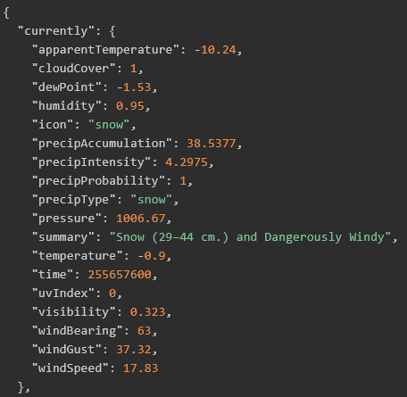
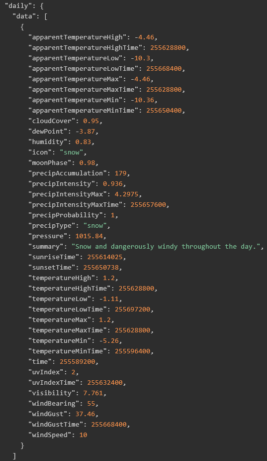

## Weyder

### 1. Installation
```cmd
npm install weyder
```

### 2. Using weyder
weyder provides two functions ``geoCode`` and ``foreCast``

#### Configuring the objects
**Create a free darksky and mapbox account, copy your own access token and pass the api name and access token to `setAccessToken`** 
```js
setAccessToken("darksky","your_DarkSky_AccessToken")
setAccessToken("mapbox","your_MapBox_AccessToken")
``` 
#### Setting the weather data time span
Use this function and set appropriate time span to get the more information from the api.

Object properties `currently, minutely, hourly, daily`, value `<boolean>`
```js
setWeatherDataSpan({
    'currently': true,
    'minutely': false,
    'daily': true
})

```
The above sets 
-  `currently = true`, 
-  `minutely = false`, 
-  `hourly = false`, 
-  `daily = true`

---
NOTE: To undestand what `currently, hourly, daily` holds, visit https://darksky.net/dev/docs#data-point

## Here's a snapshot of `currently`


## Here's a snapshot of `hourly`


## Here's a snapshot of `daily`


#### Using the api (using async/await)
```js
const {geoCode,foreCast,setAccessToken} = require('weyder');
const getWeatherData = async (location) =>{
    const geocode = await geoCode(location)
    const forecast = await foreCast(geocode)
    console.log(forecast)
}
getWeatherData("Austin")
// Output
// {
//     currently: [...],
//     hourly: [...]
//     daily: [...],
// }
```
#### Using the api (using promises)
```js
const {geoCode,foreCast,setAccessToken,setWeatherDataSpan} = require('weyder');

geoCode('Austin')
.then(geocode => foreCast(geocode))
.then(forecast => {
    console.log(forecast);
})
.catch(e=>{
    console.log(e);
})

// Output
// {
//     currently: [...],
//     hourly: [...]
//     daily: [...],
// }
```

#### Using the api (using callbacks)
```js
const {geoCode,foreCast,setAccessToken} = require('weyder');
geoCode("Austin",(err,geocode)=>{
    if(err) return err
    foreCast(geocode,(err,forecast)=>{
        if(err) return err
        console.log(forecast)
    })
})
// Output
// {
//     currently: [...],
//     hourly: [...]
//     daily: [...],
// }
```

**TODO**: 
--
1. Still thinking :^)